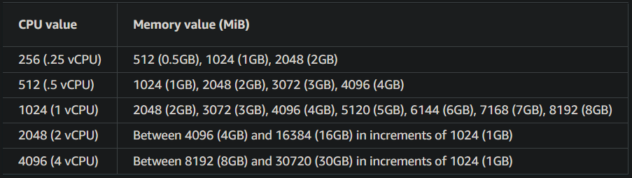

<div align="center">
  <a href="https://christiandeleon.me/">
    
  </a>

   <h1 align="center">My Personal Portfolio Infrastructure</h1>
   <a href="https://christiandeleon.me/"><strong>Visit my Portfolio Website</strong></a>

</div>

## About this Project

With the idea of showing off my skills, I have created a repository to list all of the ways I have designed infrastructures that run my portfolio using different IaC and cloud resources.

You can find that repository here: https://github.com/christian-deleon/portfolio-iac

The front end was designed and developed by me using React.Js, Javascript, HTML, and CSS.

Frontend Repository: https://github.com/christian-deleon/portfolio

Using AWS CDK ( Cloud Development Kit ) with a serverless architecture I have created a very simple application that consists of the following AWS resources:

- `AWS S3` as the backend server
- `AWS CloudFront` as the CDN ( Content Delivery Network )
- `AWS Route 53` for the domain name services
- `AWS CodePipeline` for the CI/CD ( Continuous Integration and Continuous Delivery )
- `AWS CodeBuild` which takes changes from the respective GitHub repository and builds the React application
- `AWS CodeDeploy` to deploy the application to the AWS S3 bucket running as the application backend

## Setting up this infrastructure

### Install AWS CDK

1. [Create a AWS account.](https://docs.aws.amazon.com/accounts/latest/reference/manage-acct-creating.html)

2. [Install the AWS CLI](https://docs.aws.amazon.com/cli/latest/userguide/getting-started-install.html)

3. [Configure your AWS account.](https://docs.aws.amazon.com/cli/latest/userguide/cli-configure-quickstart.html)

   ```bash
   aws configure
   ```

4. [Install AWS Cloud Development Kit (CDK) v2](https://docs.aws.amazon.com/cdk/v2/guide/getting_started.html)

5. [Bootstrap your environment:](https://docs.aws.amazon.com/cdk/v2/guide/bootstrapping.html)
   
   ```bash
   cdk bootstrap
   ```

### DNS Setup

Skip this section if you do not wish to use your own domain name.

If you would like to purchase your own domain name through AWS Route53 follow this official [AWS Guide](https://docs.aws.amazon.com/Route53/latest/DeveloperGuide/domain-register.html#domain-register-procedure).

1. If you do not already have a hosted zone in Route53 ([AWS Guide](https://docs.aws.amazon.com/Route53/latest/DeveloperGuide/CreatingHostedZone.html))

   1. Go to [Route53](console.aws.amazon.com/route53)
   2. If you're new to Route 53, choose Get started under DNS management.
   3. If you're already using Route 53, choose `Hosted zones` in the navigation pane.
   4. Choose `Create hosted zone`.
   5. In the Create Hosted Zone pane, enter the name of the domain that you want to route traffic for. You can also optionally enter a comment.
   6. For Type, accept the default value of Public Hosted Zone.
   7. Choose `Create`.

2. Update domain name servers ([AWS Guide](https://docs.aws.amazon.com/Route53/latest/DeveloperGuide/domain-name-servers-glue-records.html#domain-name-servers-glue-records-adding-changing))
   1. Go to [Route53](console.aws.amazon.com/route53)
   2. In the navigation pane, choose `Registered Domains`.
   3. Choose the name of the domain for which you want to edit settings.
   4. Choose `Add or edit name servers`.
   5. Replace the name servers with the name servers for the Route 53 hosted zone.

### Deployment

Decide which architecture you would like to deploy and follow the instructions found in the respective repository.

## Deploying this infrastructure

1. Change directory to the architecture of your choice.

2. Configure your infrastructure with the `config.yaml` file.

   For the ECS CPU and Memory configuration
<div align="left">
  
</div>

3. Synthesize the CloudFormation Templates:
    ```bash
    cdk synth
    ```

4. Deploy the GitHubConnection stack to connect your account to Github:
   ```bash
   cdk deploy GitHubConnection
   ```

5. Wait the stack to finish before continuing.

6. Accepting the GitHub connection 
   
   1. Go to [AWS CodeStar Connections](https://us-east-1.console.aws.amazon.com/codesuite/settings/connections).
   2. Choose the `github-portfolio-connection-ecs` connection.
   3. Click `Update pending connection`.

7. Deploy the PersistentParentStack and PipelineStackECS stacks:
   ```bash
   cdk deploy PersistentParentStack PipelineStack --require-approval="never"
   ```

8. Go to the [AWS CodePipeline Console](https://console.aws.amazon.com/codesuite/codepipeline/pipelines) and wait for the `PipelineStackECS` pipeline to finish.

9.  Deploy the remaining stacks:
   ```bash
   cdk deploy --all --require-approval="never"
   ``` 

## Updating ECS configuration

1. Update the `config.yaml` ecs values.

2. Re-deploy stacks:
   ```bash
   cdk deploy --all --require-approval="never"
   ``` 

## Destroying this infrastructure

If you want to destroy the stacks simply run:
   ```bash
   cdk destroy --all --force
   ```
